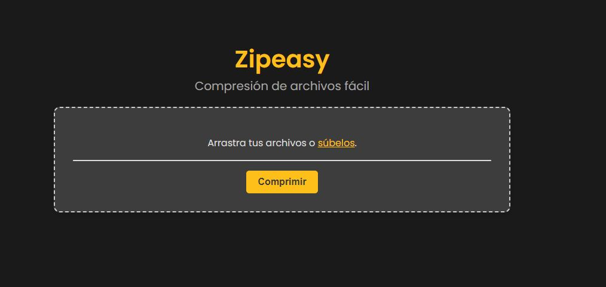

# Zipeasy
### v0.1.0


## Descripción
Pequeña y ligera aplicación web para comprimir archivos en formato **zip**.

En este proyecto he automatizado la obtención de un certificado para poder usar el protocolo *https*

## Uso
Visita la url: https://trymlmodels.com:60443

Carga los archivos que deseas comprimir en el área de selección y pulsa sobre el botón `Comprimir`



## Proceso de Configuración

### Workflow de CI/CD en Github Actions
Primero, se crea el workflow con GitHub Actions para construir la imagen y subirla a DockerHub.

`.github/workflows/docker.yml`
```yaml
name: ci to Docker Hub

on:
  push:
    branches:
      - 'main'
    paths:
      - 'src/**'
      - 'Dockerfile'
      - 'pyproject.toml'

jobs:
  docker:
    runs-on: ubuntu-latest
    steps:
      -
        name: Checkout
        uses: actions/checkout@v4
      -
        name: Set up QEMU
        uses: docker/setup-qemu-action@v3
      -
        name: Set up Docker Buildx
        uses: docker/setup-buildx-action@v3
      -
        name: Login to Docker Hub
        uses: docker/login-action@v3
        with:
          username: ${{ secrets.DOCKER_USERNAME }}  # Meterlo en los secrets del repo
          password: ${{ secrets.DOCKER_PASSWORD }}  # Meterlo en los secrets del repo
      -
        name: Build and push
        uses: docker/build-push-action@v5
        with:
          context: .
          push: true
          tags: sertemo/zipeasy:latest
```


### Configuración del proyecto en el servidor con Docker Compose
Posteriormente, desde mi servidor, se usará la imagen del DockerHub para montar la network con *docker compose*.
Para poder usar el protocolo https, hace falta un certificado. Para ello puede usarse [Certbot](https://github.com/certbot/certbot) junto con [nginx](https://github.com/nginx)

#### Instalaciones
Hay que tener instalados `nginx` y `certbot` en el servidor

```sh
sudo apt update
sudo apt install nginx
sudo apt install certbot python3-certbot-nginx
```

#### Estructura de archivo y carpetas
En el servidor creamos la carpeta del proyecto `Zipeasy`

```sh
mkdir Zipeasy
```

Dentro de ella deberemos tener los siguientes archivos y carpetas

```sh
certbot  docker-compose.yml  dockerlog.log  nginx.conf  update_docker.sh
```

El archivo update_docker.sh es opcional y se encarga de hacer pull periódicamente y actualizar los contenedores.

### Crear la Network con Docker Compose
La idea es crear una **network** con docker compose compuesta por 3 contenedores:
- **zipeasy**: La aplicación web que corre en Gunicorn y cuya imagen se obtiene de DockerHub.
- **Certbot**: Emite y actualiza periódicamente (cada 12 horas) los certificados SSL.
- **nginx**:  Actúa como proxy inverso manejando las solicitudes HTTP y HTTPS y redirigiéndolas al servidor Gunicorn que ejecuta la aplicación en Flask.

#### Obtener un certificado
Para obtener un certificado usamos el comando:

```sh
sudo certbot --nginx -d trymlmodels.com -d www.trymlmodels.com
```

Nos pedirá que añadamos en nuestro dominio un **TXT** con cierto valor. Para ello debemos ir a la página de Porkbun, en DNS y crear 2 TXT con los valores que nos proporcionan.

Una vez hecho esto se crearán los certificados en la carpeta `certbot`.

Adicionalmente he tenido que crear manualmente 2 archivos necesarios para el correcto funcionamiento de nginx:
- options-ssl-nginx.conf: Puede obtenerse de [Github](https://github.com/certbot/certbot/blob/master/certbot-nginx/certbot_nginx/_internal/tls_configs/options-ssl-nginx.conf) y se guarda en `~/Projects/Zipeasy/certbot/conf/`.
- ssl-dhparams.pem: Se puede generar mediante el comando:
```sh
openssl dhparam -out ~/Projects/Zipeasy/certbot/conf/ssl-dhparams.pem 2048
```

#### Configuración de Nginx
Configuramos Nginx mediante el archivo `nginx.conf`

Configura Nginx mediante el archivo nginx.conf para que escuche en el puerto 8080 para solicitudes HTTP y 60443 para solicitudes HTTPS 

nginx también redireccionará las solicitudes http a https de los puertos indicados previamente.

Para limitar el tamaño de los archivos a un determinado valor, se agrega el argumento **client_max_body_size**

```nginx
events {}

http {
    server {
        listen 8080;
        server_name trymlmodels.com www.trymlmodels.com;

        location / {
            return 301 https://$host:60443$request_uri;
        }

        location ~ /.well-known/acme-challenge/ {
            root /var/www/certbot;
            allow all;
        }
        client_max_body_size 10M;
    }

    server {
        listen 60443 ssl;
        server_name trymlmodels.com www.trymlmodels.com;

        ssl_certificate /etc/letsencrypt/live/trymlmodels.com/fullchain.pem;
        ssl_certificate_key /etc/letsencrypt/live/trymlmodels.com/privkey.pem;
        include /etc/letsencrypt/options-ssl-nginx.conf;
        ssl_dhparam /etc/letsencrypt/ssl-dhparams.pem;

        location / {
            proxy_pass http://zipeasy_container:4321;
            proxy_set_header Host $host;
            proxy_set_header X-Real-IP $remote_addr;
            proxy_set_header X-Forwarded-For $proxy_add_x_forwarded_for;
            proxy_set_header X-Forwarded-Proto $scheme;
        }
        client_max_body_size 10M;
    }
}
```

#### Configuración de Docker compose
Configuramos el archivop `docker-compose.yml` para crear una red con los 3 contenedores:

```yaml
services:
  web:
    image: sertemo/zipeasy:latest  # Usamos la imagen de mi DockerHub
    container_name: zipeasy_container
    expose:
      - "4321"
    environment:
      - ENV=production
    restart: unless-stopped

  nginx:
    image: nginx:latest
    container_name: nginx
    ports:
      - "8080:8080"
      - "60443:60443"
    volumes:
      - ./nginx.conf:/etc/nginx/nginx.conf
      - ./certbot/conf:/etc/letsencrypt
      - ./certbot/www:/var/www/certbot
    depends_on:
      - web
    restart: unless-stopped

  certbot:
    image: certbot/certbot
    container_name: certbot
    volumes:
      - ./certbot/conf:/etc/letsencrypt
      - ./certbot/www:/var/www/certbot
    entrypoint: "/bin/sh -c 'trap exit TERM; while :; do sleep 12h & wait $${!}; certbot renew; done;'"
    restart: unless-stopped
```

Importante el uso de los volúmenes para vincular los archivos de configuración guardados en la carpeta del proyecto a los archivos dentro de los contenedores de certbot y nginx.

### Port Forwarding
Realizamos desde la configuración del router un port forwarding de los puertos 8080 externo al 8080 interno en la ip privada del servidor.

Realizamos otra redirección del puerto 60443 externo al 60443 interno en la ip privada del servidor.

### Ejecución de la App
una vez terminada la configuración, nos situamos en el directorio de trabajo y ejecutamos la network

```sh
docker-compose up -d
```

Esto ejecutará el archivo `docker-compose.yml` y correrá los servicios.

La aplicación debería estar disponible en la siguiente dirección:

https://trymlmodels.com:60443

### Automatización con update_docker.sh

Adicionalmente se puede configurar el archivo `update_docker.sh` y ejecutarlo periódicamente mediante un cronjob para actualizar la network.

```bash
#!/bin/bash

# Configuración
COMPOSE_FILE="~/Projects/Zipeasy/docker-compose.yml"
LOG_FILE="~/Projects/Zipeasy/dockerlog.log"

# Función para añadir registros con fecha y hora a la consola y al archivo de log
log() {
    echo "$(date '+%Y-%m-%d %H:%M:%S') - $1" | tee -a $LOG_FILE
}

# Hacer pull de la última imagen
log "Haciendo pull de la última imagen..."
docker-compose -f $COMPOSE_FILE pull | tee -a $LOG_FILE 2>&1

# Detener los contenedores existentes
log "Deteniendo contenedores existentes..."
docker-compose -f $COMPOSE_FILE down | tee -a $LOG_FILE 2>&1

# Comprobar si hay cambios en la imagen y recrear los contenedores
log "Verificando si hay actualizaciones en la imagen y recreando contenedores..."
docker-compose -f $COMPOSE_FILE up -d | tee -a $LOG_FILE 2>&1

# Limpieza de imágenes no utilizadas independientemente de la actualización
log "Limpiando imágenes antiguas..."
docker image prune -f --filter "until=24h" | tee -a $LOG_FILE 2>&1
log "Limpieza de imágenes antiguas completada."

```

## SemVer
0.1.0 : Versión inicial

## Tests


## Tecnologías


## Licencia
Copyright 2024 Sergio Tejedor Moreno

Licensed under the Apache License, Version 2.0 (the "License");
you may not use this file except in compliance with the License.
You may obtain a copy of the License at

    http://www.apache.org/licenses/LICENSE-2.0

Unless required by applicable law or agreed to in writing, software
distributed under the License is distributed on an "AS IS" BASIS,
WITHOUT WARRANTIES OR CONDITIONS OF ANY KIND, either express or implied.
See the License for the specific language governing permissions and
limitations under the License.

